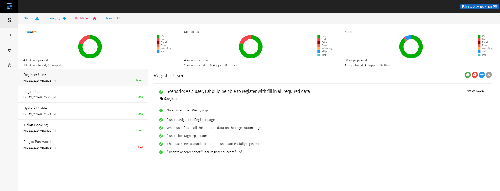

# QA-Mobile-Automation

    QA-Mobile-Automation
    ├─ report
    ├─ src
        ├─ main     
            ├─ java
                ├─ factories             # Android & driver manager
                ├─ helpers               # Java faker & keyword selenium
        ├─ test
             ├─ java
                ├─ features              # Gherkin test cases 
                ├─ pages                 # Page object
                ├─ runners               # Testng runner
                ├─ steps                 # Step definitions
            ├─ resources
    ├─ target                            # Reports are generated in the target/reports directory
    ├─ .gitignore
    ├─ pom.xml
    ├─ README.MD

